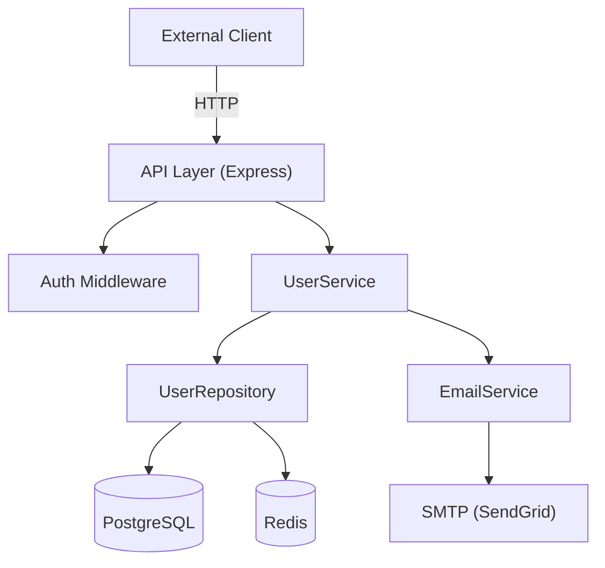
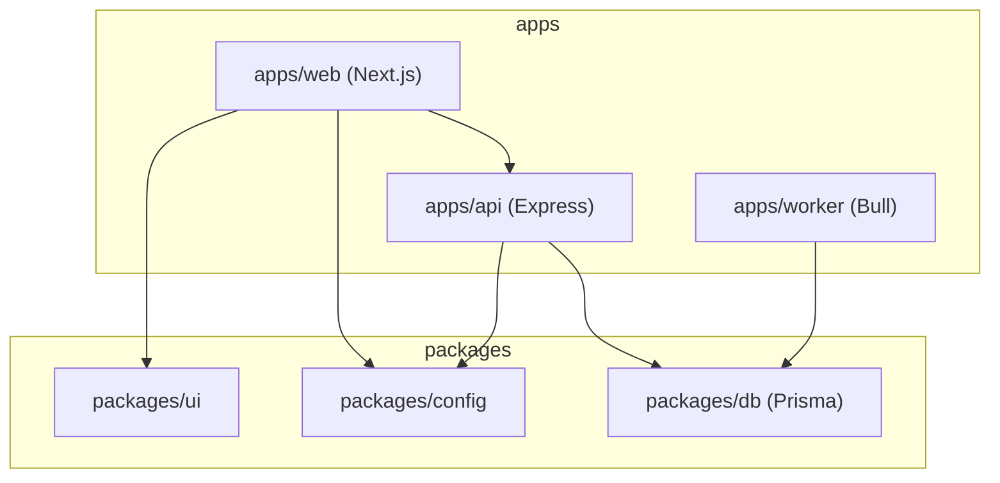

# Step 02 — Reverse-Engineer Component Architecture

**Previous step:** `step-01-scan.md`
**Next step:** `step-03-data-api.md`

---

## 1. Strategic Reading Strategy

The context window is finite. Read files in priority order:

**Priority 1 — Application Shell (read all of these):**
- Main entry point(s) detected in Step 01
- Router/route registration files (e.g., `src/routes/index.ts`, `app/routes.py`, `config/routes.rb`)
- Application factory / bootstrap (e.g., `createApp()`, `Application.java`, `app.module.ts`)
- Top-level configuration (`config/`, `settings.py`, `app.config.ts`)

**Priority 2 — Module Structure (read directory listings, spot-read files):**
- Each top-level directory under `src/` or `app/`
- Look for barrel files (`index.ts`, `__init__.py`) that export the module's public API
- Note inter-module import patterns (which modules depend on which)

**Priority 3 — Boundary and Integration Points (read selectively):**
- External HTTP calls (search for `fetch`, `axios`, `requests.get`, `http.client`, `RestTemplate`)
- Database access layer (ORM files, repository classes, `db/` setup)
- Message queue / event bus connections
- Authentication middleware registration

---

## 2. Map Components

For each major logical component found, record:

```
Component: {name}
  Type: {API handler | Service | Repository | Model | Middleware | Utility | Worker | Scheduler}
  Files: {key files}
  Responsibility: {one sentence, evidence-based}
  Depends on: [{other components}]
  Exposes to: [{other components}]
  External deps: [{npm packages / pip packages that are core to this component}]
```

---

## 3. Identify Communication Patterns

Look for evidence of each pattern:

| Pattern | Look For | Found? |
|---------|----------|--------|
| REST API | Express/FastAPI routes, `@GetMapping`, route files | ✅/❌ |
| GraphQL | `graphql`, schema files, resolvers | ✅/❌ |
| gRPC | `.proto` files, gRPC stubs | ✅/❌ |
| Message Queue | Kafka/RabbitMQ/SQS consumers/producers | ✅/❌ |
| WebSockets | `socket.io`, `ws`, WebSocket handlers | ✅/❌ |
| Cron/Scheduled Jobs | `cron`, `@Scheduled`, `celery beat` | ✅/❌ |
| Server-Side Events | SSE handlers | ✅/❌ |
| Direct function calls | Internal module calls only | ✅/❌ |

---

## 4. Detect Layers

Identify which architectural layers are present:

| Layer | Common Names | Present? |
|-------|-------------|----------|
| Presentation/API | `controllers/`, `routes/`, `handlers/`, `resolvers/` | ✅/❌ |
| Business Logic | `services/`, `use-cases/`, `domain/`, `core/` | ✅/❌ |
| Data Access | `repositories/`, `models/`, `dao/`, `store/` | ✅/❌ |
| Infrastructure | `infra/`, `adapters/`, `providers/` | ✅/❌ |
| Shared/Utils | `utils/`, `helpers/`, `common/`, `shared/` | ✅/❌ |

---

## 5. Build Mermaid Component Diagram

Produce a Mermaid diagram showing discovered components and their relationships.

**For a simple service:**


**For a monorepo:**


Scale the diagram to the actual project shape. Avoid putting every file — show modules, not files.

---

## 6. Identify External Dependencies

Categorize the key external dependencies found:

```
External Services Used:
  Databases: {PostgreSQL v14 (via Prisma), Redis 7}
  Auth: {Auth0 | JWT (self-managed) | Passport.js | ...}
  File Storage: {S3 | local disk | ...}
  Email: {SendGrid | SES | nodemailer | ...}
  Payments: {Stripe | ...}
  Monitoring: {Datadog | Sentry | OpenTelemetry | ...}
  Third-party APIs: {list}

Key runtime dependencies:
  {Express 4.18 | FastAPI 0.104 | Spring Boot 3.2 | ...}
```

---

## 7. Flag Architectural Concerns

As a read-only observer, note (without judgment) anything that warrants documentation:

```
Architectural Notes:
  ⚠️  Circular dependency detected between {ModuleA} and {ModuleB}
  ⚠️  No clear separation between service layer and data access in {directory}
  ℹ️  Configuration read directly in multiple places — no centralized config object found
  ✅  Clean dependency injection pattern in use (inversify/tsyringe/NestJS DI)
```

---

## 8. Present Architecture Summary

```
🔍 Architecture Analysis — {project_name}
════════════════════════════════════════
Pattern:    {Layered MVC | Clean Architecture | Hexagonal | Flat | Mixed}
Components: {n} major components identified
Layers:     {list}
API style:  {REST | GraphQL | gRPC | mixed | none}
Async:      {Message queue | scheduled jobs | none}

[Mermaid diagram here]

Key external integrations: {list}
Architectural concerns flagged: {n}
════════════════════════════════════════
```

⏸️ **STOP** — confirm diagram accuracy. Ask: "Does this match your mental model? Are there any components I missed?"

---

## 9. Save State

Update `{project-root}/_superml/relearn-state.yml`:
```yaml
step: "step-02-architecture"
status: "complete"
architecture_pattern: "{pattern}"
components: ["{list}"]
api_style: "{REST|GraphQL|...}"
external_services: ["{list}"]
```

Load and follow `./step-03-data-api.md`.
