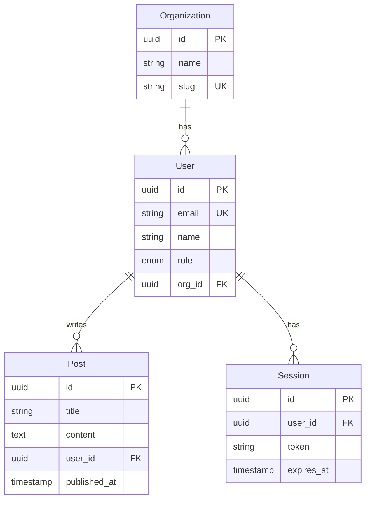

# Step 03 — Extract Data Models and API Surface

**Previous step:** `step-02-architecture.md`
**Next step:** `step-04-patterns.md`

---

## 1. Locate Data Model Definitions

Search for data model definitions in this priority order:

**ORM / Schema files:**
- Prisma: `schema.prisma` — read entire file
- TypeORM: `*.entity.ts` files — read all
- SQLAlchemy: `models.py`, `models/` — read all
- Hibernate/JPA: `@Entity` annotated files in Java/Kotlin — read all
- ActiveRecord: `app/models/` in Rails — read all
- Sequelize: `models/` — read all
- Mongoose: `*.model.ts` or `schemas/` — read all

**Database migration files** (read only schema-changing migrations, skip data migrations):
- `migrations/`, `db/migrate/`, `prisma/migrations/` — read `CREATE TABLE` statements
- Note: migrations show the evolution; use them to verify current schema if no ORM

**TypeScript / JSON Schema:**
- Zod schemas: `*.schema.ts` or files containing `z.object(`
- OpenAPI YAML/JSON spec: `openapi.yaml`, `swagger.json`, `api-spec.yaml`
- JSON Schema: `*.schema.json`

**Interface/Type files:**
- `types/`, `interfaces/`, `dtos/`, `models/` — look for data shape definitions

---

## 2. Map Entities and Their Relationships

For each entity/model discovered:

```
Entity: {User}
  Table/Collection: users
  Source file: src/models/user.entity.ts
  Fields:
    id          UUID (PK, auto-generated)
    email       string (unique, required)
    name        string
    role        enum (USER | ADMIN)
    created_at  timestamp (auto)
    updated_at  timestamp (auto)
  Relations:
    - has many Posts (userId FK)
    - has many Sessions (userId FK)
    - belongs to Organization (orgId FK)
  Constraints: email unique, soft-delete via deletedAt nullable
```

---

## 3. Build Entity Relationship Diagram

Produce a Mermaid ER diagram from discovered entities:



---

## 4. Map API Surface

### For REST APIs

Find and read all route definition files. For each route extract:

```
Endpoint: POST /api/v1/users
  Handler: UserController.create
  Auth required: yes (JWT bearer)
  Request body:
    email: string (required)
    name: string (required)
    role: USER | ADMIN (optional, default: USER)
  Response:
    201: { id, email, name, role, createdAt }
    400: { message: string } — validation error
    409: { message: string } — email already exists
  Notes: Sends welcome email via EmailService on success
```

Group by resource:
```
/api/v1/users      → UserController
/api/v1/posts      → PostController
/api/v1/auth       → AuthController
/api/v1/health     → HealthController (no auth)
```

### For GraphQL APIs

Find schema file and extract:
- Query operations
- Mutation operations
- Subscription operations
- Types and inputs

```
Query:
  users(filter: UserFilter): [User!]!
  user(id: ID!): User
  me: User

Mutations:
  createUser(input: CreateUserInput!): User
  updateUser(id: ID!, input: UpdateUserInput!): User
  deleteUser(id: ID!): Boolean
```

### For gRPC

Read `.proto` files and extract service definitions.

### For Event-Driven APIs

Document message schemas:
```
Topic: user.created
  Producer: UserService
  Consumer: EmailService, AnalyticsService
  Schema:
    userId: string
    email: string
    name: string
    timestamp: ISO8601
```

---

## 5. Identify Auth and Authorization Patterns

Look for:
- Where authentication middleware is applied
- What auth strategy is used (JWT, session, API key, OAuth2)
- How authorization rules are expressed (roles, RBAC, ABAC, ownership checks)
- Public vs protected routes

```
Auth Strategy: JWT Bearer tokens
  Token validation: AuthMiddleware (src/middleware/auth.ts)
  Applied to: All routes except /api/v1/health, /api/v1/auth/login, /api/v1/auth/register
  Token payload: { userId, email, role, iat, exp }
  
Authorization:
  Role-based: ADMIN role required for DELETE operations
  Ownership: Users can only update their own posts (checked in PostService)
```

---

## 6. Identify Validation Layer

Note where and how input is validated:
- Schema validation (Zod, Joi, class-validator, Pydantic, Marshmallow)
- Where validation is applied (middleware, controller, service)
- What happens on validation failure (error format)

---

## 7. Present Data and API Summary

```
🔍 Data & API Analysis — {project_name}
════════════════════════════════════════
Entities: {n} entities mapped
Relations: {n} relationships

API Surface:
  Style: {REST | GraphQL | gRPC | events}
  {REST: {n} endpoints across {n} resources}
  {GraphQL: {n} queries, {n} mutations, {n} subscriptions}
  Auth: {JWT | Session | API Key | None}
  Validation: {Zod | Joi | class-validator | Pydantic | none}

[ER diagram here]
[API route table here]
════════════════════════════════════════
```

⏸️ **STOP** — verify entity/API summary. Ask: "Are there any entities or endpoints I missed? Any private/internal APIs not exposed via routes?"

---

## 8. Save State

Update `{project-root}/_superml/relearn-state.yml`:
```yaml
step: "step-03-data-api"
status: "complete"
entities: ["{list}"]
api_style: "{REST|GraphQL|events}"
auth_strategy: "{JWT|Session|...}"
endpoint_count: {n}
```

Load and follow `./step-04-patterns.md`.
