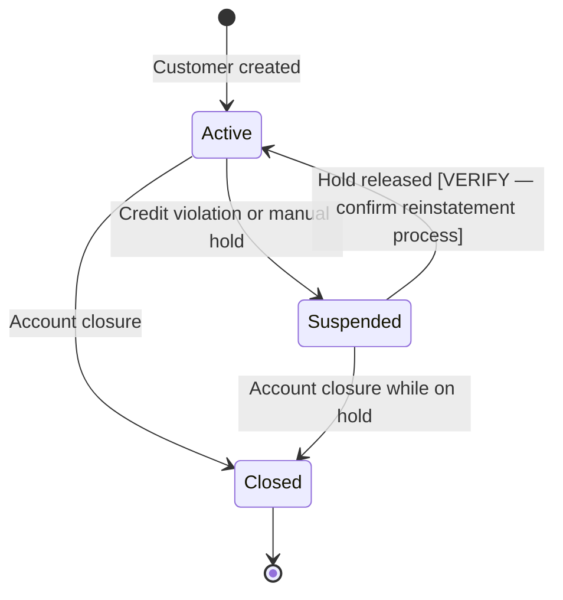

# Step 01 — Extract Domain Entities

**Previous step:** (activation)
**Next step:** `step-02-map-business-rules.md`

---

## 1. Sources to Read

Load from previously generated artifacts:
- `_superml/legacy-inventory/data-dictionary.md` — all data structures
- `_superml/legacy-inventory/programs.md` — program purposes
- Any additional documents the user provided

---

## 2. Entity Discovery Process

An **entity** in the knowledge graph is a real-world thing the business cares about. It is NOT a database table or a COBOL record — those are implementations. An entity is the concept those implementations represent.

### From Data Dictionary

For each data structure (copybook, table, physical file), ask:
- "What real-world thing does this record represent?"
- "Does this have a unique identifier?"
- "Is it something the business talks about by name?"

Pattern matching:
```
CUSTMSTR.cpy         → Customer entity
ORDERMST table       → Order entity
PRICETBL             → Price / Product entity (check for product fields)
INVNTRY              → Inventory / Product entity (may merge with above)
ACCTMST              → Account entity
POLICYMST            → Policy entity
CLAIMMST             → Claim entity
EMPMST               → Employee entity
```

### From Programs

Program names often reveal entities they operate on:
```
CUST*    → Customer operations
ORD*     → Order operations
INV*     → Invoice or Inventory (context needed)
POL*     → Policy
CLM*     → Claim
ACC*     → Account
EMP*     → Employee
```

### From External Documents

If user has provided spec documents, extract entities from:
- Nouns that appear in business process descriptions
- Things that have IDs or reference numbers
- Things that have a lifecycle (active, suspended, cancelled, expired)

---

## 3. Entity Attribute Extraction

For each entity, extract its attributes from the data dictionary:

```
Entity: Customer
Source: CUSTMSTR.cpy + CUSTOMER table + CUSTMSTR.pf

Core Attributes:
  - ID: CUST-ID / CUST_ID (8-digit numeric)
  - Name: CUST-NAME / CUST_NAME (40 chars)
  - Status: CUST-STATUS (lifecycle: Active, Suspended, Closed)
  - Credit Limit: CUST-CREDIT-LIMIT (financial ceiling, non-negative)
  - Balance: CUST-BALANCE (can be negative per PIC S)
  - Address: [INFERRED — no address fields found. Is customer address stored elsewhere?]
  - Contact: [NOT FOUND — no phone/email in master record]

Lifecycle States:
  Active (A) → standard operating state
  Suspended (S) → orders blocked, balance may still exist
  Closed (C) → permanent — no further transactions allowed

Business Questions:
  - Can a Suspended customer be reinstated to Active? [VERIFY]
  - What triggers a status change to Suspended? [VERIFY — likely credit rule]
  - Is CUST-BALANCE the current outstanding balance or something else? [VERIFY]
```

---

## 4. Entity Relationship Discovery

After listing all entities, trace relationships:

### From Foreign Keys (DB2)
```sql
-- If found:
ALTER TABLE ORDERS ADD CONSTRAINT FK_CUST FOREIGN KEY (CUST_ID) REFERENCES CUSTOMER(CUST_ID)
```
→ Order belongs to Customer (many-to-one)

### From Field Names in COBOL Records
```
If ORDER record contains field CUST-ID → Order references Customer
If ORDER record contains field PROD-ID → Order references Product
```

### From Program Logic
```
Program ORDVALD:
  Reads CUSTMSTR using CUST-ID from order → Order belongs to Customer
  Reads PRICETBL using PROD-ID from order → Order line references Product
```

### Cardinality Rules
For each relationship, determine:
- One Customer → many Orders? (likely yes — confirm)
- One Order → many Order Lines? (check for OCCURS in ORDER record)
- Can an Order exist without a Customer? (orphan orders possible?)

---

## 5. Entity File Generation

Write one file per entity to `{project-root}/_superml/knowledge-graph/entities/`:

**`entities/customer.md`:**
```markdown
---
entity: Customer
source: CUSTMSTR.cpy, CUSTOMER (DB2 table)
confidence: high
---

# Customer

The party that places orders and holds account credit with the company.

## Identity
- Identifier: 8-digit numeric code (CUST-ID)
- Name: Full name, up to 40 characters

## Lifecycle


## Attributes
| Attribute | Type | Constraint | Business Meaning |
|-----------|------|------------|-----------------|
| ID | 8-digit number | Required, unique | Identifies customer in all transactions |
| Name | Text (40) | Required | Customer's registered name |
| Status | Code (1 char) | A/S/C only | Current lifecycle state |
| CreditLimit | Decimal (9,2) | ≥ 0 | Maximum credit allowed |
| Balance | Decimal (9,2) | Can be negative | Current outstanding balance |

## Relationships
| Relationship | Target Entity | Cardinality | Notes |
|-------------|---------------|------------|-------|
| Places | Order | One-to-many | Customer can have 0..n orders |
| Has | Account | One-to-one [INFERRED] | Verify if separate Account entity needed |

## Open Questions
- [ ] What triggers suspension? Is it automatic (balance exceeds limit) or manual?
- [ ] Can a Suspended customer become Active again?
- [ ] Is contact information (phone, email) stored in a different system?
```

---

## 6. Entity Summary Table

After processing all entities, create a summary:

```
Domain Entities Discovered: {n}

| Entity | Source | Confidence | Relationships |
|--------|--------|-----------|---------------|
| Customer | CUSTMSTR.cpy | High | → Order, → Account |
| Order | ORDERMST table | High | → Customer, → OrderLine |
| OrderLine | ORDER.cpy OCCURS | Medium | → Order, → Product |
| Product | PRICETBL | Medium | [INFERRED — verify name] |
| Account | [NOT FOUND] | Low | Suspected from ACCT-ID field in CUST |
```

⏸️ **STOP** — Present entity summary. Ask user:
1. "Are there entities you expected to see that are missing?"
2. "Are there entities that are named wrong — what do you call them in the business?"
3. "Are any of these not actually separate entities — should they be merged?"

---

## Save State

Update `{project-root}/_superml/modernize-state.yml`:
```yaml
step: "step-01-extract-entities"
status: "complete"
entities_found: {n}
entity_files_written: {n}
open_questions: {n}
```

Load and follow `./step-02-map-business-rules.md`.
