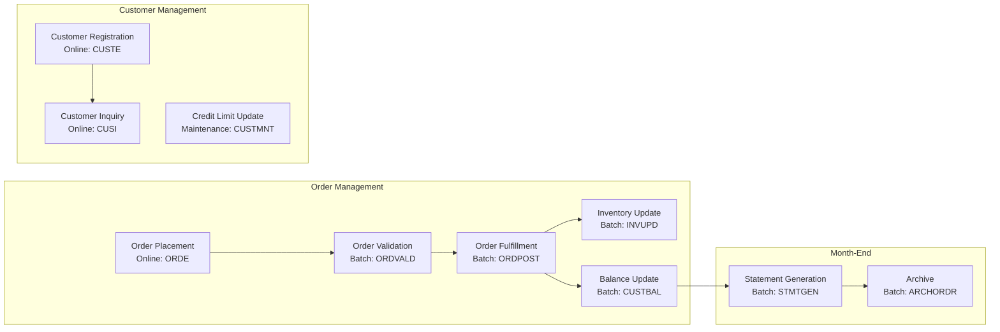

# Step 03 — Map Business Processes

**Previous step:** `step-02-map-business-rules.md`
**Next step:** `step-04-generate-graph.md`

---

## What Is a Business Process?

A business process is a sequence of activities that transforms something from one state to another, triggered by a business event.

| Implementation artifact | Business process |
|------------------------|-----------------|
| JCL job ORDPROC | "Order Processing — takes submitted customer orders through validation and posts confirmed orders to fulfillment" |
| CICS transaction ORDI | "Order Inquiry — allows customer service agents to view order status and details" |
| Program CUSTUPD | "Customer Profile Update — allows authorized users to modify customer data with audit trail" |
| Batch MONTHEND | "Month-End Close — generates monthly statements, archives transactions, updates period totals" |

---

## Process Sources

### Batch Processes (from JCL job flows)

Read `_superml/legacy-inventory/job-flows.md`. For each JCL job or job chain:

```
Job Chain: ORDPROC → ORDPOST → INVUPD → CUSTBAL

Business Process: Order Fulfillment

Trigger: Daily batch run (file ORDERS.INPUT.FILE arrives)
Actor: Batch scheduler (automated)

Steps:
  1. Validate orders against customer credit rules and inventory availability
  2. Post validated orders to order master
  3. Update inventory levels
  4. Update customer balances

Outcome (success): Orders moved from Pending → Confirmed, inventory decremented
Outcome (failure): Rejected orders written to exception file for manual review

Rules applied: RULE-001 (credit), RULE-005 (dependency), RULE-008 (inventory)
Input entities: Order (Pending)
Output entities: Order (Confirmed or Rejected), Inventory (updated), Customer.Balance (updated)
External outputs: GL entry file to accounting system
```

### Online Processes (from CICS transaction map)

For each CICS transaction chain:

```
Transaction: ORDE (Order Entry)

Business Process: Customer Order Placement

Trigger: Customer service agent receives customer request
Actor: Customer Service Representative

Screens/Steps:
  1. MENU — Navigate to Order Entry
  2. ORDE-01 — Enter customer ID → system validates customer status (RULE-002)
  3. ORDE-02 — Enter order lines (product, quantity) → system checks inventory
  4. ORDE-03 — Review order total → system checks credit limit (RULE-001)
  5. ORDE-04 — Confirm → order created in Pending status

Exception paths:
  - Customer suspended → error shown, order cannot proceed (RULE-002)
  - Credit limit exceeded → error shown with current balance (RULE-001)
  - Product out of stock → warning shown, agent can override [VERIFY — is override allowed?]

Output: Order record created in Pending status
Subsequent process: Triggers batch validation in evening run
```

### Service Processes (from program analysis)

For programs that are called on-demand (utilities, subprograms):

```
Program: TAXCALC

Business Process: Tax Calculation

Trigger: Called by order processing, invoicing, and adjustment programs
Actor: Automated (no human)

Inputs:
  - Subtotal amount
  - Customer tax class
  - Product tax category

Logic:
  1. Determine applicable tax rate from customer + product combination
  2. Apply rate to subtotal
  3. Round to 2 decimal places (RULE-004)

Output: Calculated tax amount
Rules applied: RULE-004 (tax formula), RULE-014 (tax exemptions) [if found]
Note: Tax rate lookup table source not yet identified — investigate TAXRATE table
```

---

## Process Catalog Format

Write `{project-root}/_superml/knowledge-graph/process-flows.md`:

```markdown
# Business Process Catalog — {project_name}

> Extracted from JCL job flows, CICS transactions, and program analysis.

## Process Overview



## Detailed Processes

### PROC-001 — Order Placement
**Type:** Online (CICS)
**Trigger:** Customer Service Representative receives customer request
**Actors:** Customer Service Representative, Customer (indirect)
**Pre-conditions:**
  - Customer must exist and be Active (RULE-002)
  - Products must have inventory > 0 (or backorder allowed)

**Steps:**
1. CSR enters customer ID — system validates customer exists and status = Active
2. CSR enters order lines — system shows available inventory
3. System calculates totals including tax (RULE-004)
4. System validates credit limit (RULE-001) — shows warning if at limit
5. CSR confirms — Order created in Pending status

**Business rules applied:** RULE-001, RULE-002, RULE-004
**Output entity state:** Order.status = Pending

---

### PROC-002 — Order Validation (Batch)
**Type:** Batch
**Trigger:** Daily batch schedule
**Actors:** Automated (no human in normal path)
...
```

---

## Process-to-Rules Traceability

Build traceability table showing which processes enforce which rules:

```markdown
## Process → Rules Traceability

| Process | Rules Applied |
|---------|--------------|
| PROC-001 Order Placement | RULE-001, RULE-002, RULE-004 |
| PROC-002 Order Validation | RULE-001, RULE-002, RULE-005, RULE-008 |
| PROC-003 Order Fulfillment | RULE-005, RULE-009 |
```

And the inverse — rules to processes (so we can verify no rule is lost in modernization):

```markdown
## Rules → Processes Traceability

| Rule | Enforced In |
|------|------------|
| RULE-001 Credit limit | PROC-001, PROC-002 |
| RULE-002 Customer status | PROC-001, PROC-002, PROC-005 |
| RULE-004 Tax calculation | PROC-001, PROC-006 |
```

⏸️ **STOP** — Review processes. Ask:
1. "Are there business processes you know exist that aren't listed here?"
2. "Are any process names wrong — what do you call these processes in the business?"
3. "For exception paths marked [VERIFY], can you describe what actually happens?"

---

## Save State

Update `{project-root}/_superml/modernize-state.yml`:
```yaml
step: "step-03-map-processes"
status: "complete"
processes_found: {n}
batch_processes: {n}
online_processes: {n}
processes_with_open_questions: {n}
```

Load and follow `./step-04-generate-graph.md`.
