# Step 04 — Generate Knowledge Graph

**Previous step:** `step-03-map-processes.md`
**Next step:** validate-business-rules (next skill)

---

## Assemble the Master Knowledge Graph

This step consolidates all extracted knowledge into a single master document and generates the domain glossary.

---

## 1. Write `_superml/knowledge-graph/graph.md`

This is the master document — the primary artifact of the entire modernization relearn phase.

```markdown
---
project: {project_name}
domain: {business_domain}
generated_by: Sage (SuperML Modernization Agent)
date: {date}
legacy_technology: {COBOL/RPG/J2EE/etc}
status: draft — pending BA validation
---

# Knowledge Graph — {project_name}

> This document captures the domain model of the {project_name} system.
> It was extracted from legacy {technology} code and is independent of any implementation.
> It represents what the business NEEDS — not how the old system was built.

## Entity Relationship Overview

```mermaid
erDiagram
  CUSTOMER {
    string id PK
    string name
    string status
    decimal creditLimit
    decimal balance
  }
  ORDER {
    string id PK
    string customerId FK
    string status
    decimal total
    decimal tax
    date placedDate
  }
  ORDER_LINE {
    string orderId FK
    string productId FK
    int quantity
    decimal unitPrice
    decimal lineTotal
  }
  PRODUCT {
    string id PK
    string name
    decimal price
    int stockLevel
  }
  CUSTOMER ||--o{ ORDER : "places"
  ORDER ||--|{ ORDER_LINE : "contains"
  PRODUCT ||--o{ ORDER_LINE : "appears in"
```



## Domain Entities ({n} total)

| Entity | Description | Key | Lifecycle States |
|--------|-------------|-----|-----------------|
| [Customer](./entities/customer.md) | Party that places orders | CUST-ID | Active, Suspended, Closed |
| [Order](./entities/order.md) | A purchase transaction | ORDER-ID | Pending, Confirmed, Shipped, Cancelled, Returned |
| [Product](./entities/product.md) | Sellable item | PROD-ID | Active, Discontinued |
| ...    | | | |

## Business Rules Index ({n} total)

| Rule | Category | Summary | Confidence |
|------|----------|---------|-----------|
| [RULE-001](./business-rules.md#rule-001) | Validation | Credit limit enforcement | ⭐ High |
| [RULE-002](./business-rules.md#rule-002) | State constraint | Customer status values | ⭐ High |
| [RULE-003](./business-rules.md#rule-003) | State constraint | Order status values | ⭐ High |
| [RULE-004](./business-rules.md#rule-004) | Calculation | Tax formula | ⭐ High |
| [RULE-015](./business-rules.md#rule-015) | Authorization | Manager approval threshold | ⚠️ Needs review |
| ...  | | | |

## Business Processes ({n} total)

| Process | Type | Trigger | Key Rules |
|---------|------|---------|-----------|
| [PROC-001 Order Placement](./process-flows.md#proc-001) | Online | CSR request | RULE-001, RULE-002, RULE-004 |
| [PROC-002 Order Validation](./process-flows.md#proc-002) | Batch/Daily | Scheduler | RULE-001, RULE-002, RULE-005 |
| [PROC-003 Month-End Close](./process-flows.md#proc-003) | Batch/Monthly | Calendar | RULE-016, RULE-017 |
| ...     | | | |

## External Dependencies

| System | Direction | Data | Frequency |
|--------|-----------|------|-----------|
| Order Management System | Inbound | Order file | Daily |
| General Ledger | Outbound | Accounting entries | Daily |
| EDI | Outbound | Order confirmations | Ad-hoc |

## Validation Status

```
Knowledge graph completeness:
  Entities:           {n} found | {n} validated | {n} have open questions
  Business rules:     {n} total | {n} high confidence | {n} need review
  Processes:          {n} mapped | {n} have open questions
  
  Ready for BA validation: {yes/no — yes when critical open questions answered}
```
```

---

## 2. Write Domain Glossary

Write `{project-root}/_superml/knowledge-graph/domain-glossary.md`:

```markdown
# Domain Glossary — {project_name}

> Terms used in this business domain and their precise meanings.
> Includes legacy code names, business terms, and mappings between them.

## Authoritative Business Terms

| Business Term | Legacy Code Name | Definition |
|--------------|-----------------|------------|
| Customer | CUSTMSTR, CUST-* | A party registered to place orders with the company |
| Credit Limit | CUST-CREDIT-LIMIT, CREDIT_LIMIT | Maximum outstanding balance allowed for a customer |
| Order | ORDERMST, ORD-* | A request by a customer to purchase one or more products |
| Suspended | CUST-SUSPENDED (88-level 'S') | Customer status where new orders are blocked |
| Credit Hold | [INFERRED from HOLD-CODE field] | When a customer is prevented from placing orders due to credit issues |
| Manager Approval | MGR-APPROVAL-FLG | Authorization required for orders exceeding approval threshold |

## Code Dictionaries

### Customer Status Codes
| Code | Business Name | Meaning |
|------|--------------|---------|
| A | Active | Customer in good standing |
| S | Suspended | Orders blocked, balance may exist |
| C | Closed | Account permanently closed |

### Order Status Codes
| Code | Business Name | Meaning |
|------|--------------|---------|
| P | Pending | Order entered, awaiting validation |
| C | Confirmed | Validated and accepted for fulfillment |
| S | Shipped | Dispatched to customer |
| X | Cancelled | Order voided |
| R | Returned | Goods returned |

## Abbreviations
| Abbreviation | Full Term |
|-------------|-----------|
| CSR | Customer Service Representative |
| GL | General Ledger |
| EOD | End of Day |
| MGR | Manager |
```

---

## 3. Knowledge Graph Completeness Check

Run a final completeness check:

```
Knowledge Graph Completeness Report
════════════════════════════════════

ENTITIES: {n}
  ✅ Have complete attributes: {n}
  ⚠️  Have open questions: {n}
  ❌ Placeholder only: {n}

BUSINESS RULES: {n}
  ⭐ High confidence (verified or code-explicit): {n}
  ⚠️  Inferred (needs BA confirmation): {n}
  ❌ Needs expert review: {n}

PROCESSES: {n}
  ✅ Fully mapped: {n}
  ⚠️  Have open exception paths: {n}

COVERAGE GAPS:
  Entities with no rules assigned: {list}
  Processes not covered by any rules: {list}
  Rules not enforced by any process: {list} ← potential dead code rules

READINESS FOR BA VALIDATION:
  {READY | NOT READY — {n} critical questions outstanding}
```

---

## 4. Present Completion Summary

```
🏛️ Knowledge Graph Complete — {project_name}
══════════════════════════════════════════════
Files written:
  ✅ _superml/knowledge-graph/graph.md
  ✅ _superml/knowledge-graph/business-rules.md
  ✅ _superml/knowledge-graph/process-flows.md
  ✅ _superml/knowledge-graph/domain-glossary.md
  ✅ _superml/knowledge-graph/entities/{entity}.md  ×{n}

Knowledge captured:
  Domain entities:   {n}
  Business rules:    {n}  ({n} high confidence, {n} need BA review)
  Business processes: {n}
  External systems:  {n}

Next step: validate-business-rules
  → Aria (BA agent) will review each rule with you
  → Confirm: still valid? | changed? | new rules discovered?
  
Outstanding questions for BA session: {n}
Estimated BA session time: {rough estimate based on rule count}
══════════════════════════════════════════════
```

⏸️ **STOP** — Full knowledge graph built. Confirm readiness to proceed to BA validation.

---

## Save State

Update `{project-root}/_superml/modernize-state.yml`:
```yaml
step: "step-04-generate-graph"
status: "complete"
knowledge_graph_complete: true
entities: {n}
business_rules: {n}
processes: {n}
rules_needing_ba_review: {n}
ready_for: "validate-business-rules"
```
