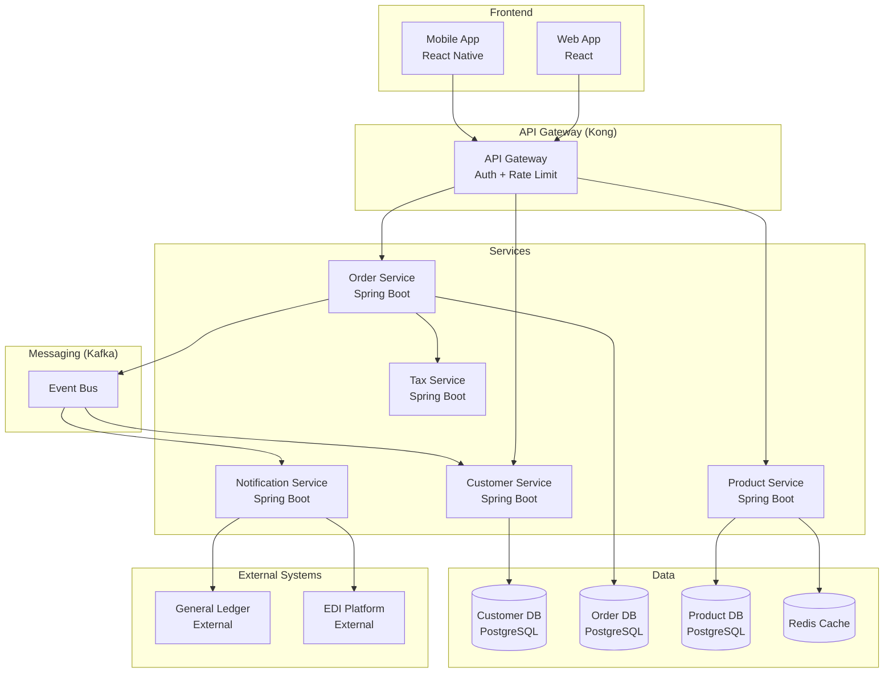

# Step 03 — Design Target Architecture

**Previous step:** `step-02-capture-tech-framework.md`
**Next step:** `step-04-migration-strategy.md`

---

## Design Approach

Architecture is designed by mapping legacy capabilities to modern components — one capability at a time. Every component in the new system must justify its existence by:
1. Implementing one or more validated business rules, OR
2. Enabling a business process, OR
3. Satisfying an architectural constraint

No components are added "just because it's modern."

---

## 1. Service Boundary Definition

Based on the knowledge graph entities and processes, define service boundaries:

### Domain-Based Service Split (recommended for microservices)

```
Service boundary candidates:
  
  Customer Service
    Responsible for: Customer lifecycle (create, update, status changes)
    Entities: Customer
    Rules owned: RULE-002 (status), RULE-007 (credit limit update authorization)
    Data: customers table
    APIs: GET/POST/PUT /customers, GET /customers/{id}/credit-status
    
  Order Service
    Responsible for: Order lifecycle from placement to fulfillment
    Entities: Order, OrderLine
    Rules owned: RULE-001 (credit check), RULE-003 (status), RULE-009 (fulfillment logic)
    Data: orders table, order_lines table
    APIs: POST /orders, GET /orders/{id}, PUT /orders/{id}/status
    External events: OrderPlaced, OrderValidated, OrderConfirmed, OrderShipped
    
  Product/Pricing Service
    Responsible for: Product catalog and pricing
    Entities: Product, Price
    Rules owned: RULE-006 (pricing), RULE-010 (discount rules), RULE-016 (tax)
    Data: products table, prices table
    APIs: GET /products, GET /products/{id}/price
    
  Tax Service (if complex)
    Responsible for: Tax calculation
    Rules owned: RULE-004 (tax formula), RULE-014 (tax exemptions)
    Note: Consider third-party tax service if jurisdiction rules are complex
    
  Notification Service
    Responsible for: All outbound communications (email, EDI)
    No business rules owned (pure orchestration)
    Events consumed: OrderConfirmed, OrderShipped
```

**If modular monolith (not microservices):**
Same boundaries, but as modules within a single deployable — shared DB, internal API calls.

---

## 2. Data Architecture

### Entity → Table Mapping

```
Legacy → Modern data model:

COBOL record CUSTMSTR.cpy → PostgreSQL table: customers
  Fields:
    CUST-ID       → id CHAR(8) NOT NULL PRIMARY KEY
    CUST-NAME     → name VARCHAR(40) NOT NULL
    CUST-STATUS   → status CHAR(1) NOT NULL DEFAULT 'A' CHECK (status IN ('A','S','C'))
    CUST-CREDIT-LIMIT → credit_limit DECIMAL(9,2) NOT NULL DEFAULT 0
    CUST-BALANCE  → current_balance DECIMAL(9,2) NOT NULL DEFAULT 0
    [ADD] created_at TIMESTAMP NOT NULL DEFAULT NOW()
    [ADD] updated_at TIMESTAMP NOT NULL
    [ADD] updated_by VARCHAR(50) NOT NULL  ← audit requirement (RULE-019)

DB2 table ORDERS → PostgreSQL table: orders
  Additional changes:
    - Add soft-delete (is_deleted boolean) if business needs record retention
    - STATUS codes retained (P/C/S/X/R) or rename to enum? [ASK USER]
    - Add version column for optimistic locking (concurrent update protection)
```

### Data Migration Notes

```
Migration complexity per entity:
  customers:    MEDIUM — VSAM binary format → SQL
    Issue: PIC S9(7)V99 → DECIMAL requires precision preservation
    Issue: REDEFINES in CUSTMSTR.cpy → business decision needed on each case
    
  orders:       LOW — DB2 directly to PostgreSQL
    Issue: Date format YYYYMMDD stored as CHAR(8) → convert to proper DATE
    
  products:     LOW — clean mapping
  
  Archive data: DISCUSS — how many years of history? Must it all migrate?
```

---

## 3. API Design

Map each legacy operation to an API endpoint:

```
Legacy CICS Transaction → Modern REST API

ORDE (Order Entry):
  POST /api/v1/orders
  Request: { customerId, lines: [{productId, qty}] }
  Response: { orderId, status: "PENDING", total, taxAmount }
  Rules enforced: RULE-001 (credit), RULE-002 (customer status)
  
CUSTE (Customer Update):
  PUT /api/v1/customers/{id}
  Authorization: requires CSR or ADMIN role (RULE-020)
  Request: { name?, creditLimit?, status? }
  Rules enforced: RULE-007 (who can change credit limit)

ORDI (Order Inquiry):
  GET /api/v1/orders/{id}
  GET /api/v1/customers/{id}/orders?status=&from=&to=
```

---

## 4. Event Design (if async/event-driven)

Map legacy batch handoffs to events:

```
Legacy file handoff → Modern event:

ORDPROC batch: validation → posting →
  Event: OrderValidated { orderId, validationResult, timestamp }
  Producer: Order Service (validation step)
  Consumer: Order Service (fulfillment step) + Audit Service

GL file output →
  Event: AccountingEntryRequired { orderId, amount, glAccount, timestamp }
  Producer: Order Service
  Consumer: GL Integration Service → forwards to GL system
```

---

## 5. Architecture Diagram

Generate Mermaid diagram:



Write diagram to `{project-root}/_superml/modernization/architecture-diagram.mmd`.

---

## 6. Architecture Decisions Record

For each significant decision, write an ADR:

```markdown
## ADR-001 — Order Service uses async validation

**Status:** Proposed
**Context:** Legacy system validates orders in nightly batch (ORDVALD). Business now wants real-time order feedback.
**Decision:** Order Service validates synchronously at order placement. Business rule RULE-001 enforced in Order Service before order is persisted.
**Consequences:** 
  - Orders rejected immediately (better UX)
  - Peak load now at order placement time (vs. nightly batch)
  - Need order rate limit if volume was previously buffered overnight
**Alternatives rejected:**
  - Async validation: Adds latency and complexity for no business benefit at current volume
```

⏸️ **STOP** — Present architecture design. Ask:
1. "Does this architecture look right for your organization?"
2. "Are there any components that should be different?"
3. "Are there any architectural decisions here you want to discuss further?"

---

## Write Target Architecture Document

Write `{project-root}/_superml/modernization/target-architecture.md` with:
- Service definitions
- API inventory
- Data model (table per entity)
- Event catalog (if async)
- Architecture diagram reference
- Architecture decisions (ADRs)
- Open items

---

## Save State

Update `{project-root}/_superml/modernize-state.yml`:
```yaml
step: "arch-step-03-design-architecture"
status: "complete"
services_defined: {n}
apis_designed: {n}
events_designed: {n}
adrs_written: {n}
```

Load and follow `./step-04-migration-strategy.md`.
