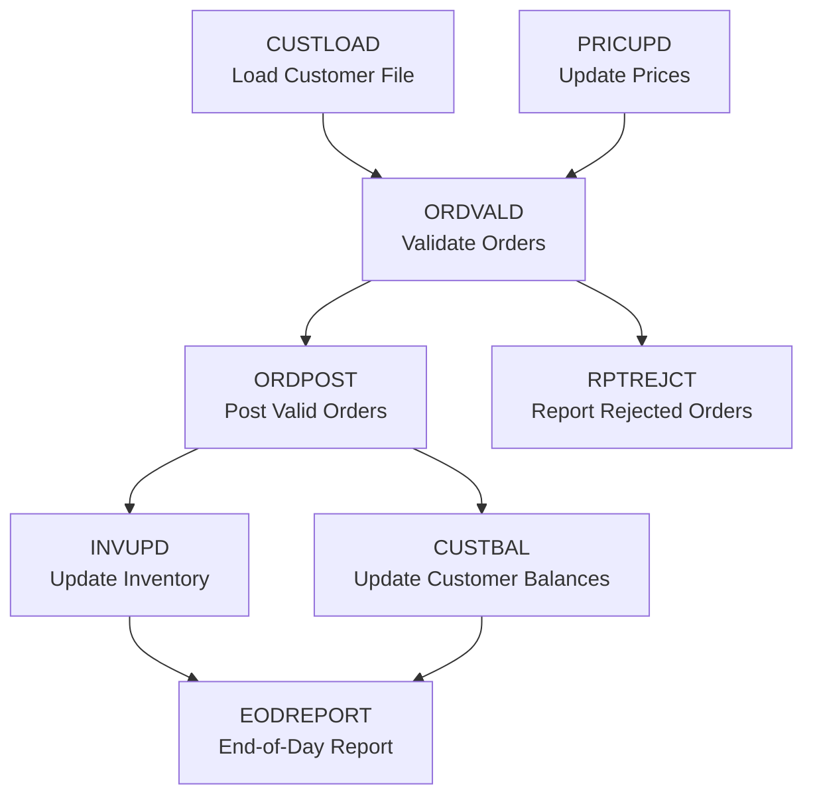
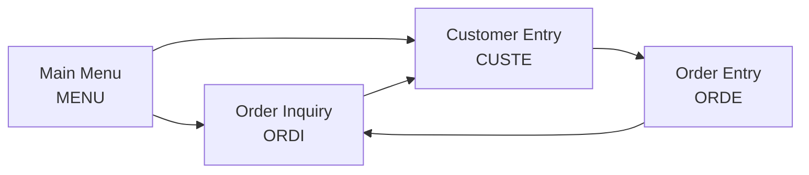

# Step 04 — Trace Job Flows, Call Graphs, and Integration Points

**Previous step:** `step-03-extract-data-structures.md`
**Next step:** build-knowledge-graph (next skill)

---

## 1. Job Flow Mapping (Mainframe JCL / Batch)

### Read JCL Job Streams

For each `.jcl` file:

```
Job: {ORDPROC}
Source: {JCL/ORDPROC.JCL}
Schedule: {inferred from SCHENV= or comments | not found}
Purpose: {from MSGCLASS, NOTIFY, and first program name — inferred}

Steps:
  Step 1: STEP010 — EXEC PGM=SORTIN
    Purpose: Sort incoming order file by customer ID
    Input:  DD INFILE  → DSN=ORDERS.INPUT.FILE
    Output: DD SORTOUT → DSN=ORDERS.SORTED.WORK

  Step 2: STEP020 — EXEC PGM=ORDVALD
    Purpose: Validate orders (calls COBOL program ORDVALD)
    Input:  DD SORTOUT (from step 1)
            DD CUSTMSTR → DSN=CUST.MASTER.FILE (customer master)
    Output: DD VALIDOUT → DSN=ORDERS.VALID
            DD REJECTOUT → DSN=ORDERS.REJECTED  ← ⭐ rejected orders exist — RULE
    Condition: COND=(0,NE) → skip if previous step failed

  Step 3: STEP030 — EXEC PGM=ORDPOST
    Purpose: Post validated orders
    Depends on: Step 2 succeeding (COND code)
```

### Build Batch Job Dependency Graph

After reading all JCL files, map dependencies:



Write to `{project-root}/_superml/legacy-inventory/job-flows.md`.

### Note Business Significance of Each Flow

- Files passed between jobs = business entity hand-offs
- Reject output files = business validation failures (every reject = a business rule)
- CONDITION codes = business dependencies (X can't run until Y succeeds because...)
- Schedule markers (daily/monthly/yearly) = business cycle significance

---

## 2. Program Call Graph

Consolidate CALL statements found in Step 02 into a call graph:

```
Call Graph:
  ORDPROC
    ├── ORDVALD (validation subprogram)
    │     ├── CUSTINQ (customer lookup)
    │     ├── PRICEINQ (price lookup)
    │     └── TAXCALC (tax calculation)
    ├── ORDPOST (order posting)
    │     ├── INVUPD (inventory update)
    │     └── ACCTPOST (accounting entry)
    └── ERRHAND (error handler — utility)
```

Identify:
- **Hub programs**: called by many others — high business importance
- **Leaf programs**: call no others — often pure business rule calculators
- **Orphan programs**: not called by anything found — may be dead code OR invoked by JCL only

---

## 3. CICS Transaction Map (Online Programs)

For each CICS transaction found:

```
Transaction: {ORDI}
Program: {ORDINQ}
Description: {Order Inquiry — [INFERRED from transaction ID]}
Map (BMS screen): {ORDMAP}
Flow:
  User enters: {Order number on BMS map}
  Program sends: {EXEC CICS RECEIVE MAP}
  Validates: {order exists, user authorized — INFERRED from VERIFY TERMINAL}
  Displays: {order details from ORDER-RECORD}
  Can navigate to: {CUSTE (customer screen) via PF3 — [READ FROM BMS MAP PFKEY]}
```

Map the transaction navigation flow (which screen goes where):



---

## 4. External Integration Points

Find all connections to systems outside this application:

### Files (Batch)
```
External Files:
  Input:
    ORDERS.INPUT.FILE     → from external order management system [source unknown — FLAG]
    PRICE.UPDATE.FILE     → from pricing system [inferred from job PRICUPD]
  Output:
    ORDERS.REJECTED       → to exception handling team (manual process?) [VERIFY]
    GL.ENTRIES.FILE       → to General Ledger system [inferred from ACCTPOST]
    EDI.OUTBOUND          → EDI output (external trading partners) ⭐ external dependency
```

### Database Connections
```
Databases accessed:
  DB2 tables: {CUSTMSTR, ORDERMST, PRICETBL, INVNTRY}
  VSAM files: {CUSTMSTR.KSDS (VSAM KSDS indexed file)}
  IMS: {if DLI calls found}
```

### Web Services / APIs (Legacy)
```
Web services called:
  {URL found in source or config}
  {WSDL references}
```

### External Programs (Non-COBOL)
```
CALL statements to non-COBOL programs:
  CALL 'CEEDATE'  → Language Environment date service (IBM utility)
  CALL 'IGZEDT4'  → COBOL date routine (system)
  CALL 'EXTCALC'  → Unknown — may be external system bridge [FLAG FOR EXPERT]
```

---

## 5. Timing and Schedule Map

Extract business cycle information:

```
Business Cycles Detected:
  Daily:
    - EODPROC JCL → End-of-day order close
    - CUSTBAL JCL → Customer balance update
  Monthly:
    - MONTHEND JCL → Monthly statement generation [inferred from job name]
    - PRICUPD JCL → Price update cycle [inferred from schedule comment]
  Ad-hoc:
    - CUSTMAINT → Customer record maintenance (online CICS)
  Unknown schedule:
    - TAXUPD → Tax table update [no schedule found — VERIFY]
```

---

## 6. Write Final Inventory Files

### `job-flows.md` — see above
### `call-graph.md`

```markdown
# Program Call Graph — {project_name}

## Entry Points (called from JCL only)
- ORDPROC, CUSTLOAD, PRICUPD, MONTHEND

## Call Hierarchy
{Full call tree}

## Hub Programs (called by 3+ other programs)
| Program | Called by | Purpose |
|---------|----------|---------|
| TAXCALC | ORDVALD, INVPOST, BILLGEN | Tax calculation engine |
| CUSTINQ | 7 programs | Customer record lookup |

## Orphan Programs (not found in any CALL or JCL EXEC)
| Program | Notes |
|---------|-------|
| OLDMISC | May be dead code — verify before discarding |
```

### `integrations.md`

```markdown
# Integration Map — {project_name}

## External Systems
| System | Direction | Method | Files/Tables | Notes |
|--------|-----------|--------|-------------|-------|
| Order Management System | Inbound | Batch file | ORDERS.INPUT.FILE | Daily |
| General Ledger | Outbound | Batch file | GL.ENTRIES.FILE | Daily |
| EDI Trading Partners | Outbound | Batch file | EDI.OUTBOUND | Ad-hoc |
```

---

## 7. Present Complete Legacy Inventory Summary

```
🏛️ Legacy Code Reading Complete — {project_name}
════════════════════════════════════════════════
Programs read:      {n}
Data structures:    {n} copybooks / {n} tables
JCL jobs:           {n}
Business rules (preliminary): {n} detected
Integration points: {n} external systems/files

Artifacts written:
  ✅ _superml/legacy-inventory/programs.md
  ✅ _superml/legacy-inventory/data-dictionary.md
  ✅ _superml/legacy-inventory/job-flows.md
  ✅ _superml/legacy-inventory/call-graph.md
  ✅ _superml/legacy-inventory/integrations.md
  ✅ _superml/legacy-inventory/expert-questions.md ({n} questions)

Confidence assessment:
  High confidence:   {n} programs (clear purpose, documented)
  Medium confidence: {n} programs (inferred from patterns)
  Low confidence:    {n} programs ([NEEDS-EXPERT-REVIEW] flagged)

════════════════════════════════════════════════
Ready for: build-knowledge-graph
```

⏸️ **STOP** — Review inventory. Answer any expert questions before proceeding to knowledge graph.

---

## Save State

Update `{project-root}/_superml/modernize-state.yml`:
```yaml
step: "step-04-trace-flows"
status: "complete"
legacy_inventory_complete: true
jcl_jobs_mapped: {n}
external_integrations: {n}
expert_questions_outstanding: {n}
ready_for: "build-knowledge-graph"
```
